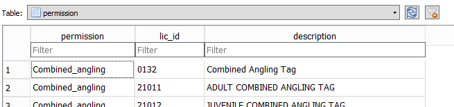
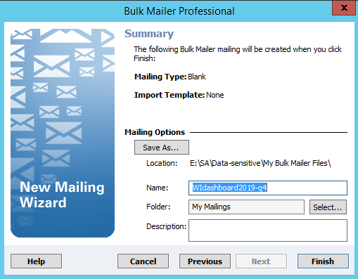
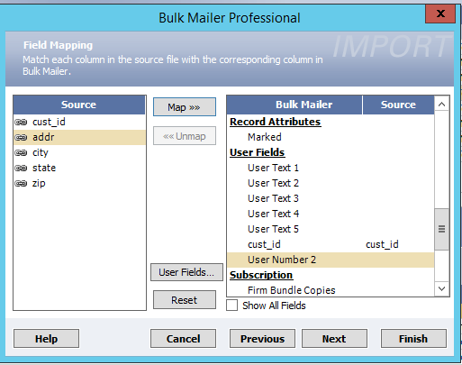

# Preparing License Data

Preparation of license data is similar to the requirements for the [National/Regional Dashboard](https://github.com/southwick-associates/salicprep/blob/master/github_vignettes/workflow-overview.md), with some additional complexity described below. 

### Getting Started

When data comes in for a new state, create template files using the R console:

```r
# for initializing new template code:
lictemplate::new_project_individual("YY", "2019-q4")
## A new individual state dashboard has been initialized:
##  E:/SA/Projects/Data-Dashboards/YY/2019-q4

# altenatively, for updating code from a previous period:
lictemplate::update_project("YY", "2020-q2", "2019-q4")
## An updated project has been initialized:
##  E:/SA/Projects/Data-Dashboards/YY/2020-q2
```

Backup existing sqlite databases that will be overwritten:

```r
lictemplate::data_backup("YY")
```

Open the new Rstudio project and setup the project package library:

```r
renv::restore()
```

## Differences to National/Regional

The workflow generally matches that of the national/regional dashboards, but with some additional requirements:

- [Legacy Data Processing](#legacy-data-processing)
- [State License Years](#state-license-years)
- [Database Schemas](#database-schemas)
- [Geocoding](#geocoding)
- [Privileges & Subtypes](#privileges-and-subtypes)

### Legacy Data Processing

Individual state dashboards have been created since 2016, and the workflow has evolved over that time. For 2019-q4, I recommend rewriting dashboard code to reflect the current lictemplate workflow and following some conventions for organizing/documenting:

- Store a README file at the top-level (`E:/SA/Projects/Data-Dashboads/[state]/README.txt`) to keep track of information useful when updating the workflow for new time periods.
    + The dashboard manager can help with referencing documentation stored on Office 365 (individual state methodologies) 
    + Previous validation summaries may have been produced using LaTeX, and are usually stored within `./1-prep-license-data/latex_documentation/documentation.pdf`
    + See WI for an example

### State License Years

The individual dashboards use state-defined license years based on effective dates (unlike strict calendar-year sale dates as is done for the national/regional dashboards). These sometimes (but not always) follow calendar years, and some percentage of sales for a given license year will fall outside the relevant dates. As a consequence the "month" variable is defined based on an unbounded integer range: `..., -1 (previous Nov), 0 (previous Dec), 1 (Jan), 2 (Feb), ..., 12 (Dec), 13 (Jan), 14 (Feb), ...` 

#### Examples

Any particular state will have its own set of reasonable month ranges. For example:

- A state may have an April 1st through March 31st license year, and people will buy licenses before the start of the license year. The "month" range might reasonably run from 2 (previous Feb) through 15 (March, the last month in the calendar year). 
- Another state may have a calendar-based license year where some people buy licenses anywhere from the previous Nov (-1) to the current-year December (12).

### Database Schemas

Data should be structured in a set of sqlite databases (similar to national/regional but with some additions):

- Data-Sensitive:
    + raw-[period].sqlite3
    + standard.sqlite3
- Data-Production:
    + license.sqlite3
    + history.sqlite3
    
#### License.sqlite3 Additional/Modified columns

The individual dashboards include some additional data columns:

- `cust$county_fips` (produced using geocoding)
- `cust$zip4dp` (temporary for checking for customer duplicates, produced using geocoding)
- `lic$priv` for defining privilege permissions (deer hunting, trout fishing, etc.)
- `lic$subtype` for permissions that represent a subset of customers holding a given privilege (e.g., spousal fishing, which tracks anglers who purchase a spouse license type).

The `sale$month` is modified to allow additional values: `..., -1, 0, 1, 2, ...`

#### History.sqlite3

The national/regional workflow creates [license history](https://southwick-associates.github.io/salic/articles/salic.html#license-history) tables only as a temporary datasets in producing [dashbord summaries](https://southwick-associates.github.io/salic/articles/salic.html#dashboard-metrics). For individual state dashboards, these history tables are stored in a database, where each table corresponds to a given privilege (hunters, anglers, deer hunters, etc.).

#### License.sqlite3 Permission Table

A `permission` table is written as part of building license histories for each permission. It is a convenience table that makes it easy to pull all license types (or sales) that contribute to a given permission. Example:



### Geocoding

Customer county and delivery point (zip4dp) can be identified by geocoding customer addresses (details below). Note that this is a fairly time-consuming process; a much quicker (although potentially less accurate) approach is to use a zip-to-county crosswalk stored in `E:/SA/Data-production/Data-Dashboards/_Shared/census.sqlite3` although this won't provide a zip4dp to aid in deduplication.

You can reference WI-2019-q4 for an example, where an R script is used to create the builk mailer import file: `.code/1-prep-license-data/03-pull-geocode.R`

#### BulkMailer Steps

1. Open BulkMailer sofware and create a New Mailing:



2. Open import/export for "Dashboard_county_append" and point to the import file, making sure fields are correctly linked (note that the cust_id user field needs to be appropriately set as Text or Number under "User Fields"):



3. Go to Address Quality >> Address Correction. Running through this process may take a while (e.g., overnight). A file larger than 1.5 million rows or so may need to be split into multiple files.

4. Run Export Wizard (Dashboard_county_append), saving three variables ("ZIP+4 + DPC", "County FIPS", "cust_id") in a text file.

### Privileges and Subtypes

Privilege/subtype permissions shouldn't need to be updated for existing states. You can access the logic that was used to identify these from the production database (license.sqlite3) in `lic$priv` (for privileges) and `lic$subtype` (for subtypes). License histories for permissions are stored in history.sqlite3.

```r
# example: count WI deer hunters from 2015 to 2018
library(tidyverse)
library(DBI)
con <- dbConnect(RSQLite::SQLite(), "E:/SA/Data-production/Data-Dashboards/WI/history.sqlite3")
deer <- tbl(con, "deer") %>% filter(year > 2015, year <= 2018) %>% collect()
dbDisconnect(con)
count(deer, year)
## A tibble: 3 x 2
#   year      n
#  <int>  <int>
#1  2016 640935
#2  2017 632154
#3  2018 620079
```
